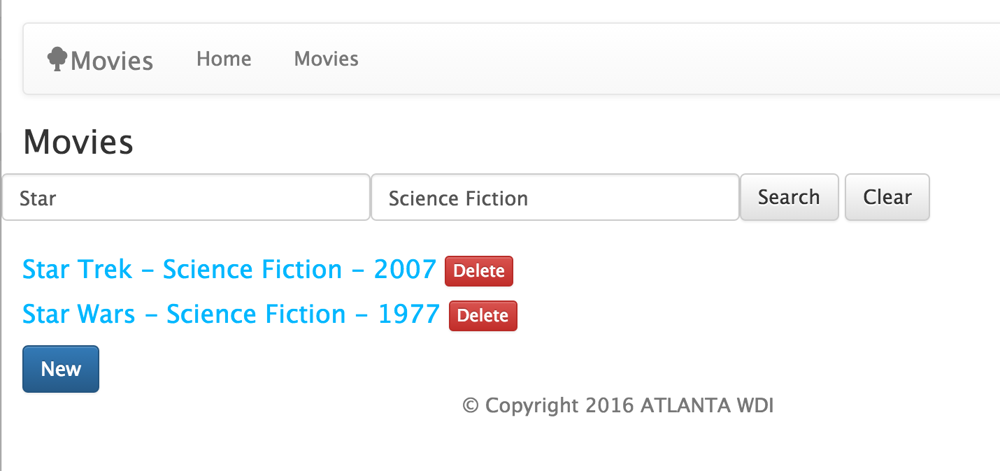

# How to do a Search Page in Express

We want to build a search page that can support the following:

* Show filtered results using search options entered by the user
* Show all results if no search options are entered

To do this we will use:

* An HTML form for the search options. Submitting the form will result in an HTTP _GET_ request.
* An _INDEX_ route that will render either all results (no search options) or filtered results (when search options are entered)
* A clear button that will clear the form and show all results

---


Screenshot of our Movies Search Page

---

## The Search Form

Here we use a form with `method="GET"` and `action=/movies`. Note that HTML forms using HTTP GET will put the form data into the URL as _query parameters_.

For example:

```html
<form id="searchForm" class="form-horizontal" method="GET" action="/movies">
  <div class="form-group col-sm-4">
    <!-- The title search input -->
    <input type="text"
           class="form-control"
           id="searchTitle"
           name="title"
           value="<%= searchOptions.title %>"
           placeholder="Title">
  </div>
  <div class="form-group col-sm-4">
    <!-- The genre search input -->
    <input type="text"
           class="form-control"
           id="searchGenre"
           name="genre"
           value="<%= searchOptions.genre %>"
           placeholder="Genre">
  </div>
  <div class="form-group col-sm-4">
    <!-- The submit button -->
    <button type="submit" class="btn btn-default">Search</button>
    <!-- The clear button -->
    <a class="btn btn-default" href="/movies">Clear</a>
  </div>
</form>
<!-- show search results here -->
```

When the above code is _submitted_ the HTTP Request will have a URL of something like:

    http://localhost:3000/movies?title=Star+Wars&genre=Science+Fiction

The browser put the title and genre search options into the HTTP Get request and when the page is returned the browser displays this URL in the browser location.

## Express Server Router code

The server code will need to inspect the `req.query` object and pull out any search options entered by the user. In the code below we use `RegExp` objects with a case-insenstive match so that partial matches will return results. For example, if the user enters "star" in the search title input Mongoose will return movies with the title "Star Wars" and "Star Trek".

Also note that we return the `req.query` object to the render method so that we can populate the form inputs with these values.

```javascript
// INDEX
router.get('/', function(req, res, next) {
  let searchOptions = {};
  // We only set searchOptions for truthy values (such as non-empty strings)
  if (req.query.title) {
    // searchOptions.title = req.query.title;
    searchOptions.title = new RegExp(req.query.title, 'i');
  }
  if (req.query.genre) {
    // searchOptions.genre = req.query.genre;
    searchOptions.genre = new RegExp(req.query.genre, 'i');
  }
  Movie.find(searchOptions).sort('-createdAt')
  .then(function(movies) {
    // Note that we call render with the original searchOptions
    // so that the search inputs can be rendered with that data displayed.
    res.render('movies/index', { movies: movies,
                                 searchOptions: req.query
                               } );
  }, function(err) {
    return next(err);
  });
});
```

The code included in this project is a working demo of this approach.
